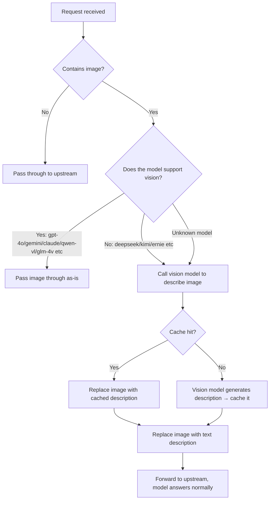

# 🦾 Vision Adapter Bridge — Give AI Models That Can't See Images a Pair of Eyes

> 🌐 **Language:** [简体中文](README.md) · [English](README.en.md)

> **Zero-dependency · Automatic image understanding · Plug & play**
>
> Turns any **non-vision** LLM (DeepSeek / Kimi / ERNIE / text-only GLM…) into an **image-capable** model:
> you just send a screenshot plus a description of the problem — the Bridge handles the rest.
> **If the model supports vision, images pass through untouched; if it doesn't, a vision model is called automatically to convert the image into text.** No manual steps.

---

> **Current version: 1.2.2 (2026-08-05)**
> Recommended workflow: use Codex skill mode. The wizard lists only registered vision models and warns about free-tier, paid, and unknown-price testing.

## Current recommendation: skill mode and one-click uninstall

```powershell
node scripts/install-skill.mjs
```

Skill mode does not require a resident bridge or a Codex `base_url` change. It installs the skill to `~/.codex/skills/auto-vision-bridge/`. Paid or unknown-price vision models are skipped by default during live tests to avoid surprise charges.

**One-click deployment for an AI assistant:** when the user already names the provider and vision model, preselect them so the wizard only asks for the API Key through its hidden prompt:

```powershell
node scripts/install-skill.mjs --provider zhipu --model glm-4.6v
```

Running `node scripts/install-skill.mjs` without flags is also fine. Skill mode needs only three inputs: **vision provider, a confirmed vision-capable model, and that provider's API Key**. It does not need an upstream URL, a CC Switch URL, or a `base_url` change.

If the user no longer wants vision support, explicitly send “I want to uninstall” or “uninstall vision” in the current chat so the AI runs the same safe uninstall flow. The manual command is:

```powershell
node scripts/uninstall.mjs --yes
```

Uninstall stops only a confirmed bridge, backs up and restores Codex `base_url`, and moves the installed skill to an uninstall-backup directory. It **does not delete the repository or print the API Key**.

**Config file locations:**

- Skill mode: `~/.codex/skills/auto-vision-bridge/scripts/config.json`
- Transparent proxy mode: the same `scripts/config.json` is read by `scripts/start-bridge.mjs`, which generates/updates `bridge/config.json`

If the user gives the provider, model, and Key to an AI, the AI must write the Key only to this local file; never echo it into chat, README files, or git.

---

## What problem does it solve?

Many models **don't support multimodal input**: when you paste a screenshot, they either error out or give nonsense answers.
Vision Adapter Bridge is a **lightweight proxy layer** (reverse proxy) between your AI client and your model service:

```
┌──────────────┐  image+question  ┌────────────────────┐  describe/pass  ┌──────────────┐
│  AI client   │ ───────────────▶ │ Vision Adapter Bridge │ ──────────────▶ │ Model service│
│    (any)     │ ◀─────────────── │   smart routing    │ ◀────────────── │  (DeepSeek)  │
└──────────────┘  normal answer   └────────────────────┘  vision model   └──────────────┘
```

**Before vs. After**

| Scenario | Before | After |
|---|---|---|
| DeepSeek / Kimi + screenshot | ❌ Errors / can't understand | ✅ Auto-recognized, answers normally |
| gpt-4o / Gemini / Claude + image | ✅ Works | ✅ Passed through untouched |
| Text only | ✅ Works | ✅ Works, zero overhead |
| Same image sent repeatedly | ❌ Pays for recognition every time | ✅ Cache hit, instant reply |
| Switching models mid-way | ⚠️ Don't know if it supports vision | ✅ Auto-detected, no config changes needed |

---

## Features

- 🧠 **Smart routing**: whitelist (known vision models) / blacklist (known text-only models) / heuristics (`vl`, `vision`, `4o`, `claude`, …). **Unknown models are treated as non-vision and auto-converted** — images never fail
- 🔌 **Zero dependencies**: Node.js built-ins only (Node ≥ 18). Runs without `npm install`
- 🖼️ **All three image channels**: Chat API (`image_url`), Responses API (`input_image`), Markdown images (``)
- ⚡ **Same-image cache**: identical images are never re-sent to the vision API (300-entry LRU)
- 📢 **Call notice**: when the vision model is invoked, the chat window first shows “📷 detecting image with vision model…” instead of appearing stuck (`noticeEnabled` toggles it, `noticeText` customizes the message)
- 🔐 **Key safety**: the vision API key lives only in the local skill `scripts/config.json` or transparent-proxy runtime config (both gitignored) — **never in git, never shared with anyone**
- 🛠️ **Interactive setup wizard**: `node scripts/setup.mjs` — silent key entry (no echo), automatic backup of old config, optional 1×1 image key verification
- 🚀 **AI one-click deployment**: send the repo URL to any AI coding assistant; it deploys → asks for config → writes the key → starts → verifies → delivers
- 🎁 **Bonus MCP mode**: the same repo ships a standard MCP Server (`analyze_image` tool) with 7 providers and 20+ free vision models

---

## How it works



### Decision logic

| Condition | Behavior |
|---|---|
| Request contains no image | Pass through as-is |
| Model name matches the vision whitelist (`gpt-4o` / `gpt-4.1` / `gpt-5` / `o1` / `o3` / `o4` / `claude` / `gemini` / `qwen-vl` / `glm-4v` / `llava` / `internvl`…) | Pass the image through as-is |
| Model name matches the non-vision blacklist (`deepseek` / `kimi` / `moonshot` / `ernie` / `baichuan` / `minimax` / `glm-4-flash` / `qwen-turbo`…) | Auto-convert via the vision model |
| Model name contains `vl` / `vision` / `omni` / `multimodal`, or `4o` / `o1` / `claude` / `gemini`, or ends with `-v` / `4v` | Treated as vision-capable, pass through |
| **Unknown model** | **Auto-convert (safest — images never fail)** |

> Both lists live in the `visionModels` / `nonVisionModels` arrays of `bridge/config.json` — edit and restart anytime.

---

## 📸 Demo

**End-to-end test** (DeepSeek, a non-vision model, + Zhipu GLM-4.6V auto vision — real run output):


**AI one-click deployment flow** (everything the AI assistant does after you send it the repo URL):


> Demo assets are generated by `docs/make-demo-assets.py` (real output rendering + deployment animation) — regenerate anytime.

---

## Quick start (~3 minutes)

### 0. Requirements

- **Node.js ≥ 18** (check with `node -v`; install from https://nodejs.org)
- A **vision model API key** (Zhipu recommended — 6M free tokens on signup, see below)

### 1. Get a vision API key (pick any)

| Provider | Sign up | Free tier |
|---|---|---|
| Zhipu BigModel (recommended) | <https://open.bigmodel.cn> → API Keys | GLM-4.6V: 6M tokens on signup |
| SiliconFlow | <https://cloud.siliconflow.cn> → API Keys | 20M tokens on signup |
| Groq | <https://console.groq.com/keys> | Free tier (rate-limited) |
| OpenRouter | <https://openrouter.ai/keys> | `:free` models are free |
| Gemini | <https://aistudio.google.com/apikey> | Free tier (rate-limited) |

### 2. Configure (pick one)

**Option A: interactive wizard (recommended)**

```powershell
cd vision-adapter-bridge
node scripts/setup.mjs
```

Follow the prompts: choose a vision provider → paste your key (**silent input, no echo**) → enter the upstream model URL → optionally verify the key with a 1×1 image. The wizard backs up any existing config automatically.

**Option B: write the config manually**

Copy `bridge/config.example.json` → `bridge/config.json` and fill in the key fields:

```json
{
  "listen": "127.0.0.1",
  "port": 57399,
  "upstream": "http://127.0.0.1:57321",
  "visionProvider": "zhipu",
  "visionApiKey": "your vision API key here",
  "visionBaseUrl": "https://open.bigmodel.cn/api/paas/v4/chat/completions",
  "visionModel": "glm-4.6v"
}
```

> `upstream` = the URL of the **model service you're currently using** (no `/v1` suffix). E.g., a local relay `http://127.0.0.1:57321`, or OpenAI's official `https://api.openai.com`.

### 3. Start the Bridge

```powershell
# Windows (hidden background window)
powershell -ExecutionPolicy Bypass -File bridge/start-bridge.ps1

# Any platform
node bridge/server.mjs
```

### 4. Verify

```powershell
# Health check
curl http://127.0.0.1:57399/health

# End-to-end test (real vision + upstream calls, covers all three scenarios)
node bridge/test-bridge.mjs --image your-test-image.png
```

Expected output: `deepseek + image → reply contains a [Image 1: ...] description`, `gpt-4o + image → passed through as-is`, `no image → normal pass-through`.

### 5. Point your AI client at the Bridge

Change your client's model API base URL (`base_url`) to `http://127.0.0.1:57399/v1` and **restart the client**.

**Codex example** (`%USERPROFILE%\.codex\config.toml`):

```toml
[model_providers.auto-vision]
name = "Vision Adapter Bridge"
base_url = "http://127.0.0.1:57399/v1"
wire_api = "responses"
```

**Any OpenAI-compatible client**: set `base_url` to `http://127.0.0.1:57399/v1`; `api_key` can be anything (e.g., `bridge`).

> From now on, just send images: **non-vision model → image auto-converted to text; vision model → passed through as-is.** Nothing else to manage.

> **Codex / CC Switch note (transparent proxy mode):** Codex must point `base_url` to `http://127.0.0.1:57399/v1`; the Bridge's `upstream` then points to CC Switch (usually `http://127.0.0.1:15721`). If Codex points directly to `15721`, CC Switch rejects the image before it reaches the Bridge with “the current model does not support vision.” The Bridge watches `config.toml` and restores its own entry when a CC Switch provider switch overwrites `base_url`. Switching providers may restart routing and disconnect the current chat; wait for the repair and retry, restarting Codex if needed.

---

## 🤖 AI one-click deployment

Send this text (plus the repo URL) to any AI coding assistant (Codex / Claude Code / Cursor / Qwen Code / Copilot…):

> Please clone and deploy this repository: **`https://github.com/yuchen0x1/vision-adapter-bridge`**
> Before deploying, ask me to confirm that I agree. Once I agree, follow the "Deployment Instructions" in `AI-DEPLOY.md` at the repo root, and ask me item by item for anything I need to decide (vision model, API key, upstream URL).

The AI will: **check the environment → clone → ask for vision model / API key / upstream URL → write the config (key never enters git) → start → health check + end-to-end verification → hand over usage instructions**.

Full instructions: [AI-DEPLOY.en.md](AI-DEPLOY.en.md) (or [简体中文](AI-DEPLOY.md)).

---

## 🔑 Don't want to share your key with an AI? Configure it yourself

Run the wizard yourself — changes take effect after restarting the Bridge:

```powershell
cd vision-adapter-bridge
node scripts/setup.mjs
```

The wizard: silent key entry (never displayed, never in git) → automatic backup of the old config → optional key verification → restart reminder.

---

## 🎁 Bonus: MCP mode (optional, tool-based image understanding)

If you prefer "the main model actively calls an image tool", this repo also ships a standard MCP Server:

```powershell
npm install
npm run build        # compile to dist/
```

Once connected, your client gets three tools: `analyze_image` (understand an image), `list_models` (list all models), `get_server_info` (service info). Ready-made config templates are in `mcp-configs/` (Claude Desktop / Cursor / VS Code / Codex); put your key in the client config's `env` field.

**Supported providers & free vision models**

| Provider | Key env var | Free vision models |
|---|---|---|
| Zhipu BigModel | `ZHIPU_API_KEY` | `glm-4.6v` (default) · `glm-4.6v-flash` |
| SiliconFlow | `SILICONFLOW_API_KEY` | `Qwen/Qwen2.5-VL-7B` · `32B` · `72B` · `Qwen/Qwen2-VL-7B` · `THUDM/glm-4v-9b` |
| Groq | `GROQ_API_KEY` | `llama-3.2-11b-vision-preview` · `llama-3.2-90b-vision-preview` |
| OpenRouter | `OPENROUTER_API_KEY` | `Qwen/Qwen2.5-VL-7B-Instruct:free` and other `:free` models |
| GitHub Models | `GITHUB_TOKEN` | `gpt-4o-mini` · `gpt-4o` · `Llama-3.2-11B-Vision-Instruct` |
| Local Ollama | No key | `moondream` (lightweight default) · `qwen2.5vl:3b` · `qwen2.5vl:7b` |
| Google Gemini | `GEMINI_API_KEY` | `gemini-2.5-flash` · `gemini-2.0-flash` |
| Cloudflare Workers AI | `CLOUDFLARE_API_TOKEN` + `CLOUDFLARE_ACCOUNT_ID` | `@cf/meta/llama-3.2-11b-vision-instruct` etc. |

> ⚠️ Note: `glm-4.7`, `glm-4.5-air` etc. are **text-only models** — don't use them as vision models (they're already in the Bridge's blacklist).

### Local open-source vision model (no API key)

The Bridge can call an open-source vision model running in local Ollama. It converts the image to text first, then sends that text to the original model that does not support images. Ollama downloads the weights locally; they are not stored in Git:

```powershell
# Install Ollama first: https://ollama.com/download
node scripts/install-local-model.mjs
node scripts/setup.mjs   # choose Local Ollama
```

The default model is `moondream`; `qwen2.5vl:3b` and `qwen2.5vl:7b` are also available. The default local endpoint is `http://127.0.0.1:11434`.

---

## Project structure

```
vision-adapter-bridge/
├── bridge/                    # ★ Main: auto-vision proxy layer (zero-dependency)
│   ├── server.mjs             #   Proxy service: smart routing + image→text + cache
│   ├── config.example.json    #   Config template (copy to config.json)
│   ├── start-bridge.ps1       #   Windows hidden-window start script
│   └── test-bridge.mjs        #   End-to-end tests (three scenarios)
├── scripts/
│   └── setup.mjs              # Interactive setup wizard (silent key / backup / verify)
├── src/                       # Bonus: MCP Server source (TypeScript)
├── test/                      # MCP smoke tests
├── mcp-configs/               # Ready-made configs for Claude / Cursor / VS Code / Codex
├── docs/                      # Demo assets + generator script
├── AI-DEPLOY.md               # AI one-click deployment instructions (简体中文)
├── AI-DEPLOY.en.md            # AI one-click deployment instructions (English)
├── README.md                  # README (简体中文)
├── README.en.md               # README (English)
├── .env.example
├── package.json
└── LICENSE                    # MIT
```

## Config reference (bridge/config.json)

| Field | Default | Description |
|---|---|---|
| `listen` | `127.0.0.1` | Bind address (keep default for local use) |
| `port` | `57399` | Listen port |
| `upstream` | `http://127.0.0.1:57321` | Upstream model service URL (no `/v1`) |
| `visionProvider` | `zhipu` | Vision provider: `zhipu` / `siliconflow` / `groq` / `openrouter` / `github` / `ollama` / `gemini` / `cloudflare` |
| `visionApiKey` | `""` | Vision model API key; Cloudflare may also use `CLOUDFLARE_API_TOKEN` |
| `visionAccountId` | `""` | Required only for Cloudflare, equivalent to `CLOUDFLARE_ACCOUNT_ID` |
| `allowPrivateImageUrls` | `false` | Allow the bridge to fetch private/loopback images; keep false by default to prevent SSRF |
| `visionBaseUrl` | Zhipu GLM-4.6V endpoint | Vision model API URL |
| `visionModel` | `glm-4.6v` | Vision model name |
| `visionPrompt` | built-in Chinese prompt | Prompt that makes the vision model "describe the image fully, including OCR" |
| `visionTimeoutMs` | `60000` | Vision call timeout |
| `maxDescChars` | `4000` | Max description length |
| `cacheSize` | `300` | Image description cache size |
| `visionModels` | see template | Model keywords known to support vision (hit → pass through) |
| `nonVisionModels` | see template | Model keywords known to be text-only (hit → convert) |

## Auto-start (optional)

**Windows Scheduled Task**:

```powershell
$action  = New-ScheduledTaskAction -Execute "powershell" -Argument "-ExecutionPolicy Bypass -File `"$PWD\bridge\start-bridge.ps1`""
$trigger = New-ScheduledTaskTrigger -AtStartup
Register-ScheduledTask -TaskName "AutoVisionBridge" -Action $action -Trigger $trigger -RunLevel Limited
```

**Linux / macOS**: `systemd` service or `pm2 start bridge/server.mjs --name auto-vision-bridge`.

---

## FAQ

**Q: Can a user clone the repo and configure it from the chat in one step?**

Yes. Run `node scripts/install-skill.mjs`. The AI only needs to confirm three items: vision provider, vision model, and API Key. If the user already chose the provider and model, use `--provider` and `--model`, for example:

```powershell
node scripts/install-skill.mjs --provider zhipu --model glm-4.6v
```

The wizard silently writes the Key to `~/.codex/skills/auto-vision-bridge/scripts/config.json` and runs the health check. It does not enable transparent proxy mode or change Codex `base_url` by default. Restart Codex after installation so the skill is loaded.

**Q: Why can transparent proxy mode show “vision is not supported” after a CC Switch change?**

Only transparent proxy mode uses `base_url`. The correct route is `Codex → http://127.0.0.1:57399/v1 → CC Switch (usually 15721) → upstream model`. Do not point Codex directly at `15721`. The Bridge restores an overwritten `base_url` after startup; switching providers may disconnect the current chat, so wait for recovery and reopen Codex if needed.

**Q: Which file should a customer edit manually?**

Usually none. To troubleshoot or change the vision model, edit:

```text
~/.codex/skills/auto-vision-bridge/scripts/config.json
```

Change `provider`, `model`, `baseUrl`, and `apiKey`, then run `node scripts/doctor.mjs --test`. Do not edit the example file or put the Key in a git-tracked file.


| Symptom | Cause & fix |
|---|---|
| `curl /health` fails | Bridge isn't running: run `node bridge/server.mjs`, check if the port is occupied |
| Model answers off-topic after sending an image | The image didn't reach the Bridge: make sure the client `base_url` points to `http://127.0.0.1:57399/v1` and restart the client |
| "Model unavailable" error | The upstream relay doesn't have that model name; switch back to a model the upstream supports (the Bridge only handles vision, it doesn't swap models) |
| Vision API returns 401/403 | Wrong key or provider restrictions: re-run `node scripts/setup.mjs` |
| Vision API returns 429 | Free tier rate limit: switch to `glm-4.6v` or another provider |
| Image larger than 15MB | Compress it first; the Bridge truncates or rejects oversized images |
| I want a model to **always pass through / always convert** | Add the model name to `visionModels` or `nonVisionModels` in `bridge/config.json`, then restart |
| Config changes have no effect | Restart the Bridge process (config is read only at startup) |
| Client says "**this model does not support image input**" | Codex/cc-switch: the Bridge auto-fixes the model catalog on startup (adds `image` to `input_modalities` for every model, and re-fixes it after every model switch). Restart the client after the fix. Other clients: use `modelAliases` to map a vision-capable name (e.g. `gpt-4o`) to your real model, and the Bridge will force image-to-text conversion. |
| "**API Key not configured**" when sending an image | `visionApiKey` in `bridge/config.json` is still a placeholder. Run `node scripts/setup.mjs` or fill it in manually, then restart the Bridge. |
| Port already in use on startup | The Bridge is probably already running (the start script detects this and skips). To change the port, edit `port` in `bridge/config.json` and restart. |
| `doctor.mjs` / `test-bridge.mjs` tests blocked by upstream 401 | The scripts now auto-read `experimental_bearer_token` from Codex `config.toml`; if absent they warn and fall back to a placeholder Key |
| `[catalog修复]` keeps failing to find the model catalog | If `model_catalog_json` in `config.toml` is an absolute path, the Bridge now uses it directly instead of joining it onto the home dir again (double-path fix) |

---

## 💬 Community Group

Have questions, feature requests, or just want to chat about AI? Scan the QR code to join the QQ group (Group ID: 1016190748):

<p align="center"></p>

(If scanning is inconvenient, you can also search the group ID directly in QQ.)

## License

[MIT](LICENSE) © yuchen0x1
