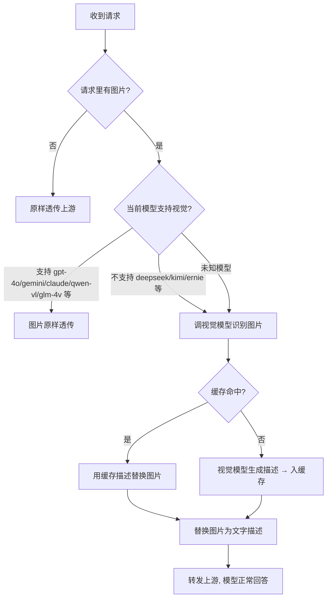
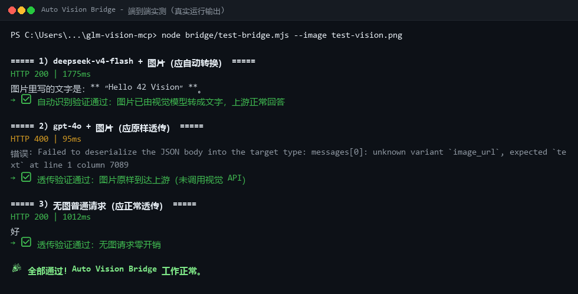
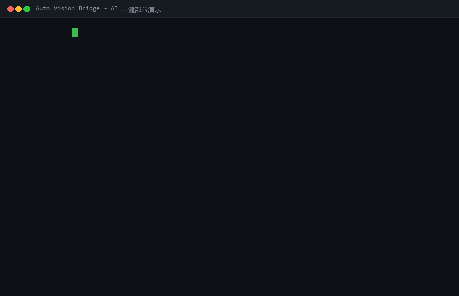
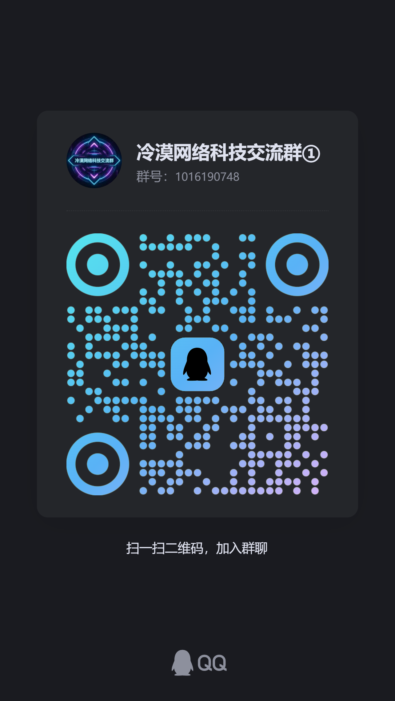

# 🦾 Auto Vision Bridge — 给不会看图的 AI 自动装上眼睛

> 🌐 **语言切换:** [简体中文](README.md) · [English](README.en.md)


> **零依赖 · 自动识图 · 即插即用**
>
> 把任意**不支持视觉**的大模型（DeepSeek / Kimi / 文心 / GLM 文本版……）变成"能看图"的模型：
> 你照常发截图 + 描述问题，剩下的交给 Bridge —— **模型支持视觉就原样透传，不支持就自动调视觉模型识别成文字**，全程无需手动操作。

---

## 它解决什么问题？

很多模型**不支持多模态**：你一发截图，模型要么报错、要么答非所问。
Auto Vision Bridge 是夹在你 AI 客户端与模型服务之间的**轻量中转层**（反向代理）：

```
┌────────────┐   发图+问题    ┌──────────────────┐   识别/透传   ┌──────────────┐
│ AI 客户端   │ ────────────▶ │ Auto Vision Bridge │ ──────────▶ │ 你的模型服务   │
│ (任意)     │ ◀──────────── │ 智能判断+自动识图   │ ◀────────── │ (DeepSeek等)  │
└────────────┘    正常回答    └──────────────────┘  调用视觉模型  └──────────────┘
```

**使用前后对比**

| 场景 | 之前 | 之后 |
|---|---|---|
| DeepSeek / Kimi 等 + 截图 | ❌ 报错 / 看不懂 | ✅ 自动识别后正常回答 |
| gpt-4o / Gemini / Claude 等 + 图 | ✅ 正常 | ✅ 原样透传，完全不受影响 |
| 只发文字 | ✅ 正常 | ✅ 正常，零开销 |
| 同一张图反复发 | ❌ 重复花钱识别 | ✅ 缓存命中，秒回 |
| 中途切换模型 | ⚠️ 不知道支不支持识图 | ✅ 自动判断，不用改任何配置 |

---

## 特性

- 🧠 **智能判断**：白名单（明确支持视觉）/ 黑名单（明确不支持）/ 启发式（`vl`、`vision`、`4o`、`claude` 等特征）三档自动决策；**未知模型按"不支持"处理，自动转文字** —— 保证发图永远不会报错
- 🔌 **零依赖**：只用 Node.js 原生模块（Node ≥ 18），不 `npm install` 也能跑
- 🖼️ **三种图片通道全覆盖**：Chat API（`image_url`）、Responses API（`input_image`）、Markdown 图片（``）
- ⚡ **同图缓存**：同一张图不重复调用视觉 API（300 条 LRU 缓存），省钱又省时
- 📢 **调用提示**：需要调用视觉模型时，聊天窗口会先显示「📷 正在调用视觉模型识别图片…」，不再干等没反应（`noticeEnabled` 可开关，`noticeText` 可改文案）
- 🔐 **Key 安全**：视觉 API Key 只存在本地 `bridge/config.json`（已 gitignore），**不进 git、不发给任何人**
- 🛠️ **交互式配置向导**：`node scripts/setup.mjs` —— 静默输入 Key（不回显）、自动备份旧配置、可选 1×1 图验证 Key
- 🚀 **AI 一键部署**：把仓库地址发给任意 AI 编程助手，自动完成部署 → 逐项询问配置 → 写 Key → 启动 → 验证 → 交付
- 🎁 **附赠 MCP 模式**：同一仓库还提供标准 MCP Server（`analyze_image` 工具），支持 7 家服务商 20+ 免费视觉模型

---

## 工作原理



### 判断逻辑一览

| 条件 | 行为 |
|---|---|
| 请求里没有图片 | 原样透传 |
| 模型名命中视觉白名单（`gpt-4o` / `gpt-4.1` / `gpt-5` / `o1` / `o3` / `o4` / `claude` / `gemini` / `qwen-vl` / `glm-4v` / `llava` / `internvl`……） | 图片原样透传 |
| 模型名命中非视觉黑名单（`deepseek` / `kimi` / `moonshot` / `ernie` / `baichuan` / `minimax` / `glm-4-flash` / `qwen-turbo`……） | 自动调视觉模型转文字 |
| 模型名带 `vl` / `vision` / `omni` / `multimodal`，或 `4o` / `o1` / `claude` / `gemini` 等特征，或以 `-v` / `4v` 结尾 | 视为支持视觉，透传 |
| **未知模型** | **自动转文字（最稳妥，发图绝不报错）** |

> 白名单 / 黑名单都写在 `bridge/config.json` 的 `visionModels` / `nonVisionModels` 数组里，随时可增删。

---

## 📸 演示

**端到端实测**（DeepSeek 无视觉模型 + 智谱 GLM-4.6V 自动识图，真实运行输出）：



**AI 一键部署流程**（把仓库地址发给任意 AI 助手后，AI 自动完成的全部步骤）：



> 演示素材由 `docs/make-demo-assets.py` 生成（真实输出渲染 + 部署流程动画），可自行重新生成。

---

## 快速开始（约 3 分钟）

### 0. 环境要求

- **Node.js ≥ 18**（`node -v` 检查；没有就装 https://nodejs.org ）
- 一个**视觉模型 API Key**（推荐智谱，注册送 600 万 tokens，见下）

### 1. 获取视觉 API Key（任选一家）

| 服务商 | 申请入口 | 免费额度 |
|---|---|---|
| 智谱 BigModel（推荐） | <https://open.bigmodel.cn> → API Keys | GLM-4.6V 注册送 600 万 tokens |
| 硅基流动 | <https://cloud.siliconflow.cn> → API 密钥 | 注册送 2000 万 tokens |
| Groq | <https://console.groq.com/keys> | 免费档（限速） |
| OpenRouter | <https://openrouter.ai/keys> | `:free` 模型免费 |
| Gemini | <https://aistudio.google.com/apikey> | 免费档（限速） |

### 2. 配置（二选一）

**方式 A：交互式向导（推荐）**

```powershell
cd auto-vision-bridge
node scripts/setup.mjs
```

按提示操作：选择视觉服务商 → 粘贴 Key（**静默输入，不回显**）→ 填上游模型地址 → 可选"用 1×1 图验证 Key"。向导自动备份旧配置。

**方式 B：手写配置**

复制 `bridge/config.example.json` → `bridge/config.json`，填写关键字段：

```json
{
  "listen": "127.0.0.1",
  "port": 57399,
  "upstream": "http://127.0.0.1:57321",
  "zhipuApiKey": "在这里填你的视觉模型 API Key",
  "visionBaseUrl": "https://open.bigmodel.cn/api/paas/v4/chat/completions",
  "visionModel": "glm-4.6v"
}
```

> `upstream` = 你**正在用的模型服务地址**（不带 `/v1`）。例如本地中转 `http://127.0.0.1:57321`，或 OpenAI 官方 `https://api.openai.com`。

### 3. 启动 Bridge

```powershell
# Windows（隐藏窗口后台启动）
powershell -ExecutionPolicy Bypass -File bridge/start-bridge.ps1

# 任意平台
node bridge/server.mjs
```

### 4. 验证

```powershell
# 健康检查
curl http://127.0.0.1:57399/health

# 端到端测试（真实调用视觉模型 + 上游模型，覆盖三种场景）
node bridge/test-bridge.mjs --image 你的测试图片.png
```

测试输出应看到：`deepseek + 图片 → 返回里带 [图片1: ...] 描述`、`gpt-4o + 图片 → 原样透传`、`无图 → 正常透传`。

### 5. 接入你的 AI 客户端

把客户端的模型 API 地址（`base_url`）改为 `http://127.0.0.1:57399/v1`，**重启客户端**即可。

**Codex 示例**（`%USERPROFILE%\.codex\config.toml`）：

```toml
[model_providers.auto-vision]
name = "Auto Vision Bridge"
base_url = "http://127.0.0.1:57399/v1"
wire_api = "responses"
```

**任意 OpenAI 兼容客户端**：`base_url` 填 `http://127.0.0.1:57399/v1`，`api_key` 随便填（如 `bridge`）。

> 以后直接发图就行：**模型不支持视觉 → 自动调视觉模型转文字；模型支持视觉 → 原样透传**，什么都不用管。

---

## ❓ 常见问题

**Q：客户端提示「此模型不支持图片输入，请尝试其他模型」？**

部分客户端（如 Codex）会按模型目录判断能否发图，把中转/第三方模型当成纯文本模型，在图片到达 Bridge 之前就拦下了。Bridge 已内置自动处理：

- **Codex / cc-switch 用户**：Bridge 启动时会**自动检测并修复**模型目录（把所有模型的 `input_modalities` 动态补上 `image`，不写死任何模型名）；用 cc-switch 切换模型导致目录被覆盖时，也会自动重新修复。修复后**重启客户端**即可发图。
- **其他客户端**：可用 `modelAliases` 别名绕过 —— 客户端配置一个"支持视觉"的模型名（如 `gpt-4o`），Bridge 收到请求后映射回你的真实模型名，并强制走自动识图：

```json
"modelAliases": { "gpt-4o": "你的真实模型名" }
```

**Q：发图后提示「未配置有效的视觉模型 API Key」？**

说明 `bridge/config.json` 里的 `zhipuApiKey` 还是占位符。运行 `node scripts/setup.mjs` 交互式配置（静默输入，不回显），或手动填写后重启 Bridge。

**Q：启动时提示端口被占用？**

说明 Bridge 可能已在运行（启动脚本会自动检测并跳过重复启动）。若确实要换端口，改 `bridge/config.json` 的 `port` 后重启。

---

## 🤖 AI 一键部署

把下面这段话连同仓库地址发给任意 AI 编程助手（Codex / Claude Code / Cursor / 通义灵码 / Copilot……）：

> 请克隆并部署这个仓库：**`https://github.com/nhzhongguo/auto-vision-bridge`**
> 部署前先确认我是否同意部署；同意后按仓库根目录 `AI-DEPLOY.md` 的「部署指令」执行，
> 需要我决定的配置项（视觉模型、API Key、上游地址）逐项问我。

AI 会自动完成：**环境检查 → 克隆 → 询问视觉模型 / API Key / 上游地址 → 写配置（Key 不进 git）→ 启动 → 健康检查 + 端到端验证 → 交付使用说明**。

完整指令见 [AI-DEPLOY.md](AI-DEPLOY.md)。

---

## 🔑 不想把 Key 发给 AI？自助配置

如果不想让 AI 助手经手你的 Key，自己跑一遍向导即可，改完重启 Bridge 就生效：

```powershell
cd auto-vision-bridge
node scripts/setup.mjs
```

向导会：静默输入 Key（不显示、不进 git）→ 自动备份旧配置 → 可选验证 Key → 提示重启。

---

## 🎁 附赠：MCP 模式（可选，手动调用识图）

如果你更习惯"主模型主动调用识图工具"的方式，本仓库同时提供标准 MCP Server：

```powershell
npm install
npm run build        # 编译到 dist/
```

客户端接入后获得 `analyze_image`（识图）、`list_models`（列出全部模型）、`get_server_info`（服务信息）三个工具。现成配置模板在 `mcp-configs/`（Claude Desktop / Cursor / VS Code / Codex），Key 填在客户端配置的 `env` 字段里。

**支持的服务商与免费模型**

| 提供商 | Key 环境变量 | 免费视觉模型 |
|---|---|---|
| 智谱 BigModel | `ZHIPU_API_KEY` | `glm-4.6v`（默认）· `glm-4.6v-flash` |
| 硅基流动 | `SILICONFLOW_API_KEY` | `Qwen/Qwen2.5-VL-7B` · `32B` · `72B` · `Qwen/Qwen2-VL-7B` · `THUDM/glm-4v-9b` |
| Groq | `GROQ_API_KEY` | `llama-3.2-11b-vision-preview` · `llama-3.2-90b-vision-preview` |
| OpenRouter | `OPENROUTER_API_KEY` | `Qwen/Qwen2.5-VL-7B-Instruct:free` 等 `:free` 模型 |
| GitHub Models | `GITHUB_TOKEN` | `gpt-4o-mini` · `gpt-4o` · `Llama-3.2-11B-Vision-Instruct` |
| Google Gemini | `GEMINI_API_KEY` | `gemini-2.5-flash` · `gemini-2.0-flash` |
| Cloudflare Workers AI | `CLOUDFLARE_API_TOKEN` + `CLOUDFLARE_ACCOUNT_ID` | `@cf/meta/llama-3.2-11b-vision-instruct` 等 |

> ⚠️ 注意：`glm-4.7`、`glm-4.5-air` 等是**纯文本模型**，不要把它们当视觉模型用（Bridge 的黑名单里已经内置了这些）。

---

## 目录结构

```
auto-vision-bridge/
├── bridge/                    # ★ 主角：自动识图中转层（零依赖）
│   ├── server.mjs             #   中转服务：智能判断 + 识图替换 + 缓存
│   ├── config.example.json    #   配置模板（复制为 config.json 使用）
│   ├── start-bridge.ps1       #   Windows 隐藏窗口启动脚本
│   └── test-bridge.mjs        #   端到端测试（三种场景）
├── scripts/
│   └── setup.mjs              # 交互式配置向导（静默输 Key / 备份 / 验证）
├── src/                       # 附赠：MCP Server 源码（TypeScript）
├── test/                      # MCP 冒烟测试
├── mcp-configs/               # Claude / Cursor / VS Code / Codex 现成配置
├── AI-DEPLOY.md               # AI 一键部署指令（发给任意 AI 助手）
├── .env.example
├── package.json
└── LICENSE                    # MIT
```

## 配置项参考（bridge/config.json）

| 字段 | 默认值 | 说明 |
|---|---|---|
| `listen` | `127.0.0.1` | 监听地址（本机用默认即可） |
| `port` | `57399` | 监听端口 |
| `upstream` | `http://127.0.0.1:57321` | 上游模型服务地址（不带 `/v1`） |
| `zhipuApiKey` | `""` | 视觉模型 API Key（支持任意 OpenAI 兼容视觉端点） |
| `visionBaseUrl` | 智谱 GLM-4.6V 端点 | 视觉模型接口地址 |
| `visionModel` | `glm-4.6v` | 视觉模型名 |
| `visionPrompt` | 内置中文提示词 | 让视觉模型"完整描述图片，含 OCR"的提示词 |
| `visionTimeoutMs` | `60000` | 视觉调用超时 |
| `maxDescChars` | `4000` | 描述文本最大长度 |
| `cacheSize` | `300` | 图片描述缓存条数 |
| `visionModels` | 见模板 | 明确支持视觉的模型关键词（命中→透传） |
| `nonVisionModels` | 见模板 | 明确不支持视觉的模型关键词（命中→转文字） |

## 开机自启（可选）

**Windows 计划任务**：

```powershell
$action  = New-ScheduledTaskAction -Execute "powershell" -Argument "-ExecutionPolicy Bypass -File `"$PWD\bridge\start-bridge.ps1`""
$trigger = New-ScheduledTaskTrigger -AtStartup
Register-ScheduledTask -TaskName "AutoVisionBridge" -Action $action -Trigger $trigger -RunLevel Limited
```

**Linux / macOS**：`systemd` 服务或 `pm2 start bridge/server.mjs --name auto-vision-bridge`。

---

## 常见问题（FAQ）

| 现象 | 原因与解决 |
|---|---|
| `curl /health` 连不上 | Bridge 没启动：运行 `node bridge/server.mjs`，检查端口是否被占用 |
| 发图后模型答非所问 | 图片没走到 Bridge：确认客户端 `base_url` 已指向 `http://127.0.0.1:57399/v1` 并重启客户端 |
| 报「模型不可用」 | 上游中转没有这个模型名，换回上游支持的模型即可（Bridge 只负责识图，不换模型） |
| 视觉识别报 401/403 | Key 错误或服务商限制：重新 `node scripts/setup.mjs` 配置 |
| 识别报 429 | 免费档限流：换 `glm-4.6v` 或换服务商 |
| 图片超过 15MB | 压缩后再发；Bridge 对超大图片会截断或报错 |
| 我想让某个模型**总是透传/总是转换** | 把模型名加进 `bridge/config.json` 的 `visionModels` 或 `nonVisionModels`，重启生效 |
| 改了配置没生效 | 重启 Bridge 进程（配置只在启动时读取） |

---

## 💬 交流群

遇到问题、想提需求、或一起交流 AI 玩法？扫码加入交流群（QQ 群号：1016190748）：

<p align="center"></p>

（若扫码不便，也可在 QQ 直接搜索群号加入）

## License

[MIT](LICENSE) © nhzhongguo
